# MZKZG Transport Card

Tablica odjazdów komunikacji miejskiej Trójmiasta i okolic dla Home Assistant. Integracja + karta Lovelace.

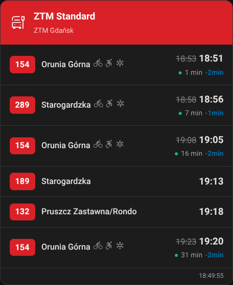

## Obsługiwani operatorzy

| Operator | Dane | Realtime |
|----------|------|----------|
| **ZTM Gdańsk** | API TRISTAR + baza pojazdów | ✅ opóźnienia, capabilities pojazdu |
| **ZKM Gdynia** | API ZDiZ | ✅ opóźnienia |
| **MZK Wejherowo** | GTFS statyczny | ❌ tylko rozkład |
| **PKP/SKM/Polregio** | PLK OpenData API | ✅ opóźnienia, peron, tor |

## Instalacja

### HACS (zalecane)
1. Dodaj repozytorium custom: `https://github.com/toczke/mzkzg-transport-card`
2. Zainstaluj "MZKZG Transport"
3. Restart Home Assistant

### Ręczna
1. Skopiuj `custom_components/mzkzg_transport/` do swojego HA
2. Restart Home Assistant

## Konfiguracja integracji

Settings → Devices & Services → Add Integration → **MZKZG Transport**

Wybierz operatora, przystanek i gotowe. Dla PKP/SKM potrzebny klucz API z [dane.plk-sa.pl](https://dane.plk-sa.pl).

## Karta Lovelace

Karta rejestruje się automatycznie. Dodaj przez UI: **Add Card → MZKZG Transport Card**.

### Opcje konfiguracji

| Opcja | Opis | Domyślnie |
|-------|------|-----------|
| `entities` | Lista sensorów | wymagane |
| `title` | Tytuł karty | auto z nazwy przystanku |
| `display_preset` | `standard` / `compact` / `e_ink` | `standard` |
| `view_mode` | `mixed` / `tabs` | `mixed` |
| `max_departures` | Maks. odjazdów (3-20) | 10 |
| `header_color` | Kolor nagłówka (hex) | auto z providera |
| `filter_routes` | Filtruj linie (lista) | brak |
| `destination_filter` | Filtruj kierunki | brak |
| `filter_platform` | Filtruj po peronie | brak |
| `filter_track` | Filtruj po torze | brak |
| `highlight_mode` | Podświetlaj zamiast ukrywać | `false` |
| `hide_terminus` | Ukryj kończące bieg/trasę | `true` |
| `realtime_only` | Tylko odjazdy realtime | `false` |
| `show_delays` | Pokaż opóźnienia | `true` |
| `show_footer` | Czas aktualizacji | `true` |
| `show_bike` | Ikona miejsca na rower | `true` |
| `show_wheelchair` | Ikona miejsca na wózek | `true` |
| `show_ac` | Ikona klimatyzacji | `true` |
| `show_ticket_machine` | Ikona biletomatu | `true` |
| `refresh_interval` | Odświeżanie countdownu (s) | 60 |

## Galeria

<strong>ZTM Gdańsk — Standard</strong>

<strong>ZKM Gdynia — Standard</strong>

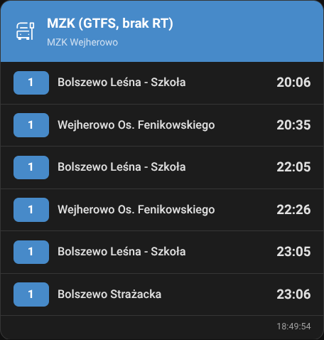

<strong>MZK Wejherowo — GTFS (brak realtime)</strong>

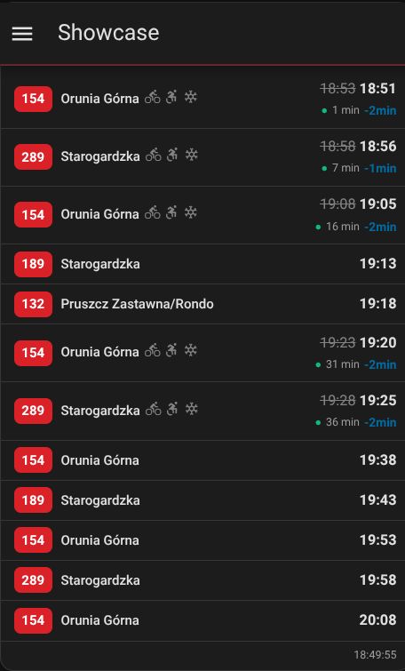

<strong>PKP/SKM — Kolej z peronem i torem</strong>

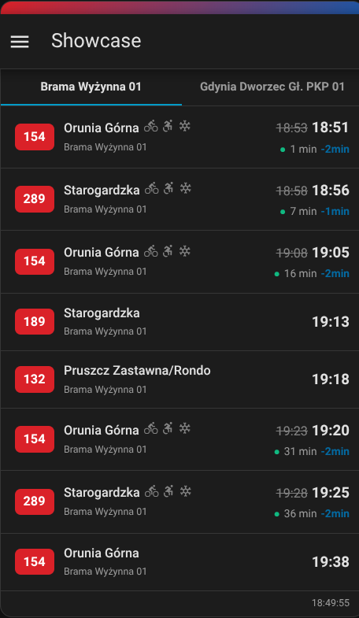

<strong>Preset: Kompakt</strong>

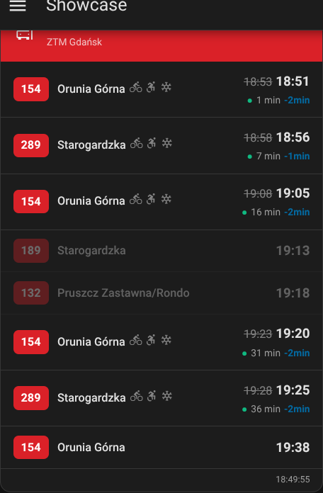

<strong>Preset: E-ink</strong>

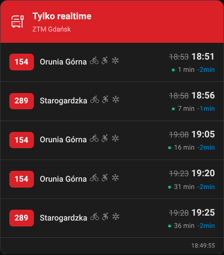

<strong>Multi-provider — widok mieszany</strong>

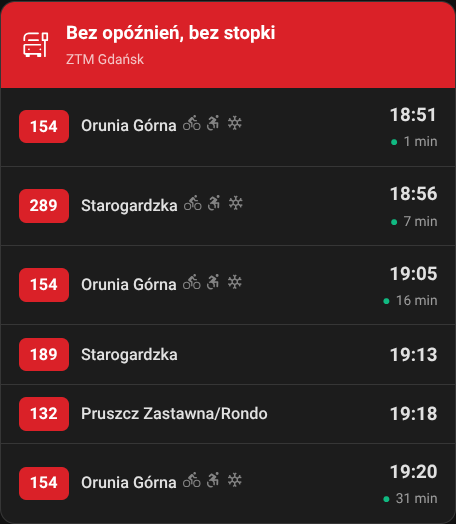

<strong>Multi-provider — zakładki</strong>

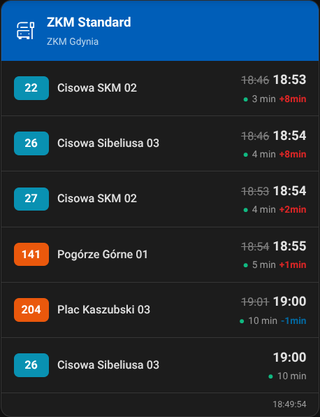

<strong>Filtr linii</strong>

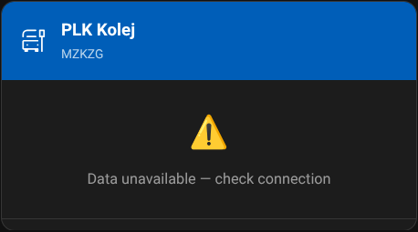

<strong>Highlight mode</strong>

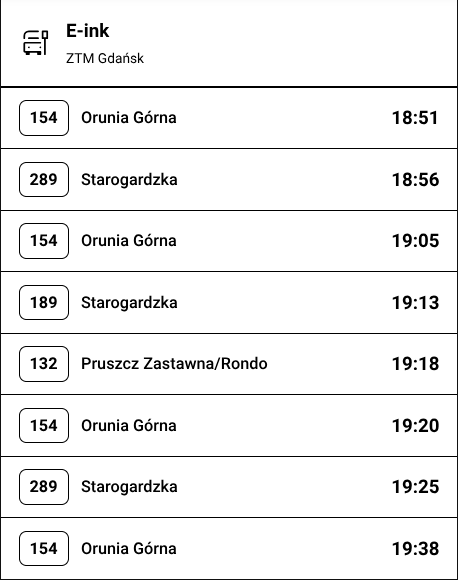

<strong>Filtr kierunku</strong>

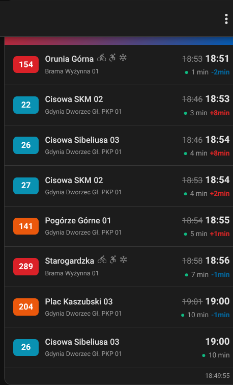

<strong>Tylko realtime</strong>

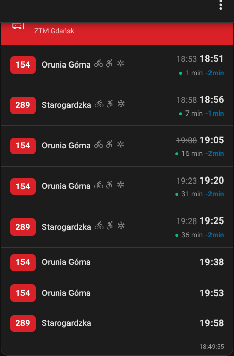

<strong>Custom kolor nagłówka</strong>

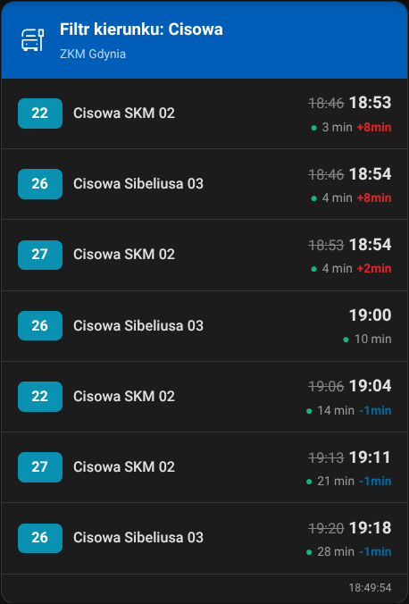

<strong>Bez opóźnień i stopki</strong>

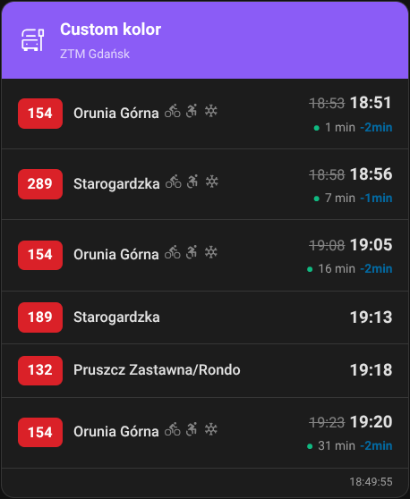

## Capabilities pojazdów (ZTM Gdańsk)

Karta automatycznie pobiera bazę pojazdów ZTM i wyświetla ikony:
- 🚲 Miejsce na rower
- ♿ Miejsce na wózek
- ❄️ Klimatyzacja
- 🔌 USB
- 🎫 Biletomat

Dane aktualizowane co 7 dni.

## PLK — rate limiting

Integracja dynamicznie oblicza interwał odświeżania na podstawie:
- Tier API (basic: 100 req/h, standard: 500, premium: 2000)
- Liczby skonfigurowanych stacji

Rozkład cachowany na cały dzień, realtime odpytywany w bezpiecznych interwałach.

## Changelog

### 1.1.0
- Capabilities pojazdów ZTM (rower, wózek, klima, USB, biletomat)
- Numer boczny pojazdu
- PLK: peron i tor jako chipy
- Filtrowanie po peronie/torze
- Dynamiczny rate limiting PLK
- Edytor: wszystkie opcje dostępne wizualnie
- Fix: focus w edytorze konfiguracji
- Fix: e-ink nie resetuje ustawień
- Zgodność z HA 2026.3+ (brand/, device_info, async_unload)

### 1.0.0
- Pierwsza wersja
- ZTM, ZKM, MZK, PLK
- Presety: standard, compact, e-ink
- Filtrowanie, highlight, tabs

## Licencja

MIT
