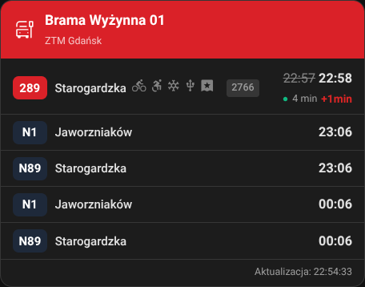
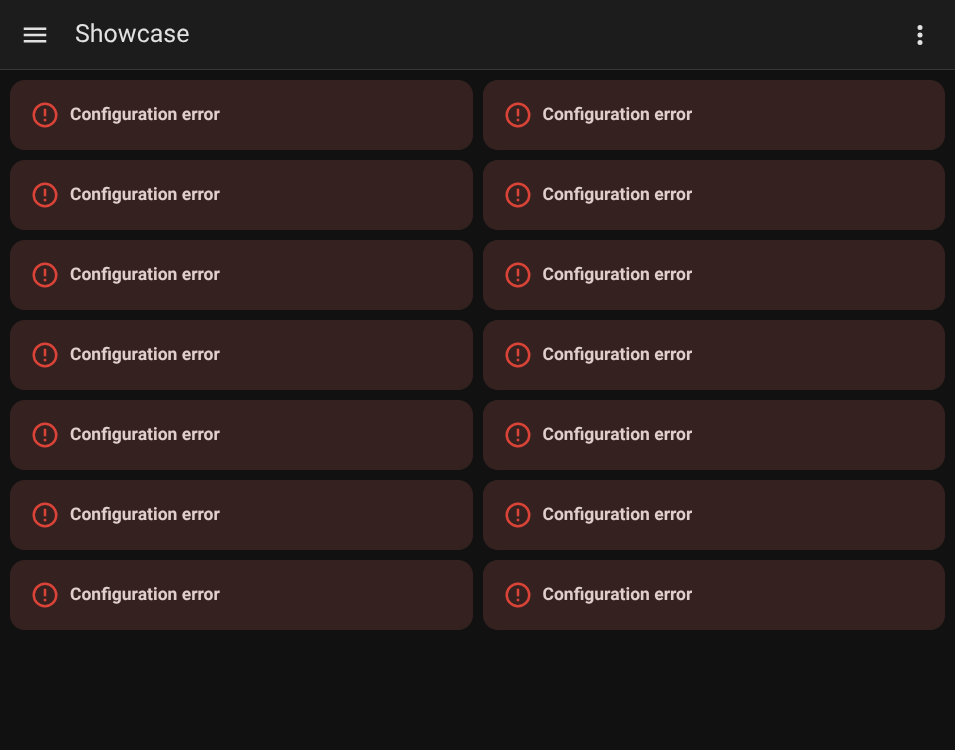

# MZKZG Transport Card

[](https://github.com/hacs/integration)
[](https://github.com/toczke/mzkzg-transport-card/releases)
[](LICENSE)
[](#testing)

Real-time departure board for Tricity (Gdańsk, Gdynia, Sopot) and surrounding area public transport in Home Assistant.

Custom integration + Lovelace card with visual editor.



---

## Table of Contents

- [Supported Operators](#supported-operators)
- [Installation](#installation)
- [Integration Setup](#integration-setup)
- [Card Configuration](#card-configuration)
- [Display Presets](#display-presets)
- [Data Sources & Fetching](#data-sources--fetching)
- [Vehicle Capabilities](#vehicle-capabilities-ztm-gdańsk)
- [PLK Rate Limiting](#plk-rate-limiting)
- [Project Structure](#project-structure)
- [Testing](#testing)
- [Gallery](#gallery)
- [Changelog](#changelog)
- [License](#license)

---

## Supported Operators

| Operator | Data Source | Realtime | Features |
|----------|------------|----------|----------|
| **ZTM Gdańsk** | TRISTAR API | ✅ delays | Vehicle capabilities, fleet DB |
| **ZKM Gdynia** | ZDiZ API | ✅ delays | Route mapping |
| **MZK Wejherowo** | Static GTFS | ❌ schedule only | Night services (>24h) |
| **PKP/SKM/Polregio/IC** | PLK OpenData API | ✅ delays | Platform, track, carrier info |

---

## Installation

### HACS (recommended)

1. Open HACS → Integrations → ⋮ → Custom repositories
2. Add: `https://github.com/toczke/mzkzg-transport-card` (type: Integration)
3. Install **MZKZG Transport**
4. Restart Home Assistant

### Manual

```bash
cp -r custom_components/mzkzg_transport/ /config/custom_components/
```

Restart Home Assistant.

---

## Integration Setup

**Settings → Devices & Services → Add Integration → MZKZG Transport**

1. Select provider (ZTM / ZKM / MZK / PLK)
2. For PLK: enter API key (see below)
3. Select stop from the list
4. Done — sensor + binary sensor created automatically

### PKP/PLK API Key

Railway data requires a free API key:

1. Go to [https://pdp-api.plk-sa.pl](https://pdp-api.plk-sa.pl)
2. Register a free account
3. Navigate to **API** → **API Keys**
4. Generate a new key (tier "basic" = 100 requests/hour)
5. Paste during integration setup

The integration dynamically manages rate limits based on your tier and number of stations.

---

## Card Configuration

The card registers automatically. Add via: **Add Card → MZKZG Transport Card**

All options available in the visual editor:



### Options Reference

| Option | Description | Default |
|--------|-------------|---------|
| `entities` | Sensor entity list | required |
| `title` | Card title | auto from stop name |
| `icon` | Header icon (MDI) | auto (bus-stop/train) |
| `display_preset` | `standard` / `compact` / `e_ink` | `standard` |
| `view_mode` | `mixed` / `tabs` (multi-entity) | `mixed` |
| `max_departures` | Max departures shown (3-20) | 10 |
| `header_color` | Header color (hex) | auto from provider |
| `filter_routes` | Show only these routes | — |
| `destination_filter` | Filter by destination name | — |
| `filter_platform` | Filter by platform number | — |
| `filter_track` | Filter by track number | — |
| `highlight_mode` | Dim non-matching instead of hiding | `false` |
| `hide_terminus` | Hide departures ending at this stop | `true` |
| `realtime_only` | Show only realtime departures | `false` |
| `show_delays` | Show delay information | `true` |
| `show_footer` | Show "Odświeżono: HH:MM:SS" | `true` |
| `show_bike` | Show bike rack icon | `true` |
| `show_wheelchair` | Show wheelchair ramp icon | `true` |
| `show_ac` | Show air conditioning icon | `true` |
| `show_ticket_machine` | Show ticket machine icon | `true` |
| `refresh_interval` | Countdown refresh (seconds) | 60 |

### YAML Example

```yaml
type: custom:mzkzg-transport-card
entities:
  - sensor.mzkzg_ztm_1327
  - sensor.mzkzg_zkm_35190
title: "Mój przystanek"
icon: mdi:tram
display_preset: standard
view_mode: tabs
max_departures: 8
filter_routes:
  - "154"
  - "289"
show_delays: true
show_footer: true
```

---

## Display Presets

| Preset | Use Case | Shows |
|--------|----------|-------|
| **Standard** | Daily use | Full info: delays, icons, capabilities, footer |
| **Compact** | Small widgets | Minimal: route + headsign + time only |
| **E-ink** | E-ink displays | Static times, no animations, high contrast |

---

## Data Sources & Fetching

### ZTM Gdańsk

- **Departures**: `ckan2.multimediagdansk.pl/departures?stopId={id}`
- **Vehicle fleet**: `mapa.ztm.gda.pl/d/otwarte-dane/ztm/baza-pojazdow.json` (cached 7 days)
- **Refresh**: every 30 seconds
- **Data**: realtime delays, vehicle code, capabilities (bike/wheelchair/AC/USB/ticket machine)

### ZKM Gdynia

- **Departures**: `zdiz.gdynia.pl` ZDiZ delays API
- **Routes**: ZDiZ routes API (cached, retry after 1h on failure)
- **Refresh**: every 30 seconds
- **Data**: realtime delays, route short names

### MZK Wejherowo

- **Source**: Static GTFS from `mkuran.pl/gtfs/wejherowo.zip`
- **Cache**: GTFS file cached on disk, refreshed daily
- **Refresh**: every 30 seconds (recalculates from static schedule)
- **Data**: scheduled times only, supports night services (>24:00)
- **Thread safety**: asyncio.Lock on GTFS singleton

### PKP/PLK (Railway)

- **Schedules**: `pdp-api.plk-sa.pl/api/v1/schedules` (cached daily)
- **Realtime**: `pdp-api.plk-sa.pl/api/v1/operations` (shared cache across stations)
- **Refresh**: dynamic interval based on tier/stations (see Rate Limiting)
- **Data**: delays, platform, track, carrier, train number, category (IC/SKM/R/TLK)
- **Thread safety**: asyncio.Lock on shared operations cache

---

## Vehicle Capabilities (ZTM Gdańsk)

The card fetches the ZTM vehicle fleet database and displays icons for the actual vehicle:

| Icon | Meaning |
|------|---------|
| 🚲 | Bike rack |
| ♿ | Wheelchair ramp |
| ❄️ | Air conditioning |
| 🔌 | USB charging |
| 🎫 | Ticket machine |

Vehicle number (numer boczny) is shown as a chip next to the headsign.

Fleet data refreshed every 7 days (~330KB).

---

## PLK Rate Limiting

The integration dynamically calculates refresh intervals:

```
interval = 3600 / ((hourly_limit × 0.8) / num_stations)
```

| Tier | Limit | 1 station | 4 stations |
|------|-------|-----------|------------|
| Basic | 100/h | 60s | 180s |
| Standard | 500/h | 60s | 60s |
| Premium | 2000/h | 60s | 60s |

- Schedule data cached for the entire day (1 request per station per day)
- Operations (realtime) shared across all PLK stations
- Rate limit hits tracked in `sensor.plk_api_usage`
- On 429: returns cached/empty data instead of failing

### API Usage Sensor

`sensor.*_plk_api_usage` tracks:
- `state`: total requests since HA start
- `rate_limit_hits`: number of 429 responses
- `last_success`: timestamp of last successful request

---

## Project Structure

```
custom_components/mzkzg_transport/
├── __init__.py          # Entry setup, card registration, unload
├── config_flow.py       # Multi-step config flow (provider → API key → stop)
├── coordinator.py       # Data fetching (ZTM, ZKM, MZK, PLK)
├── sensor.py            # Departure sensor + PLK API usage sensor
├── binary_sensor.py     # Delay alert binary sensor
├── const.py             # Constants, URLs, tier limits
├── gtfs_provider.py     # GTFS parser for MZK Wejherowo
├── strings.json         # UI strings
├── translations/        # en.json, pl.json
├── manifest.json        # Integration metadata
├── brand/               # Icon for HA UI
└── www/
    └── mzkzg-transport-card.js  # Lovelace card

mzkzg-transport-card.js  # Source card (copied to www/ on build)
tests/
├── test_integration.py  # ZTM, ZKM, coordinator tests
└── test_extended.py     # PLK, GTFS, binary sensor tests
```

---

## Testing

```bash
# Run all tests
python -m pytest tests/ -v

# Current: 25 tests passing
# Covers: ZTM fetch, ZKM fetch, PLK schedules, PLK rate limit,
#          GTFS parsing, binary sensor logic, vehicle fleet
```

Tests use `aioresponses` for HTTP mocking and `MagicMock` for HA core.

---

## Screenshots

### ZTM Gdańsk — Standard view with vehicle capabilities


---

## Changelog

### 1.2.1

- **Responsive layout** with CSS container queries
- **Custom header icon** (MDI) with auto-detection (train/bus-stop)
- **Compact mode** hides capabilities, vehicle number and footer
- **PLK API usage sensor** (requests count, rate limit hits)
- **PLK graceful degradation** — no crash on rate limit, shows empty data
- Slimmer header, friendlier rate limit message
- Icons wrap below headsign when no space
- E-ink icon color fix (black on white)
- Footer: "Odświeżono: HH:MM:SS"

### 1.1.0

- **Vehicle capabilities** from ZTM fleet database (bike, wheelchair, AC, USB, ticket machine)
- **Vehicle number** display
- **PLK**: platform and track as chips, carrier name shortening
- **Custom icon** support (MDI) with auto-detection (train/bus-stop)
- **Filter by platform/track**
- **PLK API usage sensor** (requests count, rate limit hits)
- **Responsive layout** with CSS container queries
- **Compact mode** hides capabilities and footer
- **Dynamic PLK rate limiting** (limit ÷ stations)
- Visual editor: all options available
- Fix: editor focus loss (stopPropagation + debounce)
- Fix: e-ink preset no longer resets settings
- Fix: PLK entry loads even on rate limit (no crash)
- HA 2026.3+ compliance (brand/, device_info, async_unload)

### 1.0.0

- Initial release
- ZTM, ZKM, MZK, PLK providers
- Presets: standard, compact, e-ink
- Filtering, highlight, tabs
- Binary sensor for delay alerts

---

## License

[MIT](LICENSE) © Tomasz Toczek
